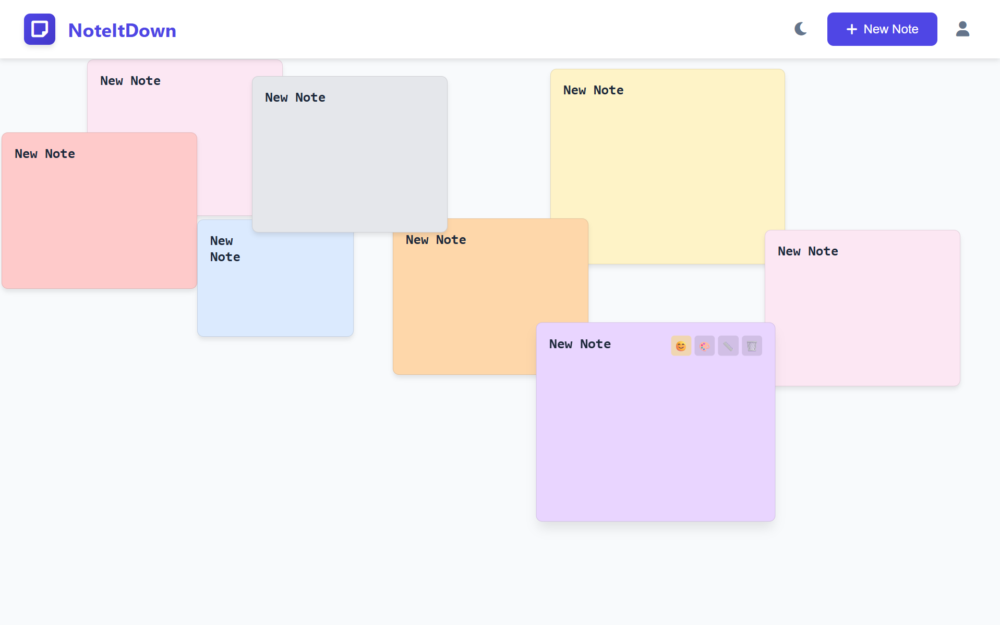

# 📝 NoteItDown - Personal Notes App

A beautiful, user-friendly notes application with themes, customizable note sizes, and emoji support. Built with Node.js, Express, MongoDB, and vanilla JavaScript.



## ✨ Features

- 🔐 **User Authentication** - Secure login and registration
- 📝 **Create & Edit Notes** - Rich text notes with drag-and-drop positioning
- 🎨 **Customizable Notes** - Multiple colors and sizes
- 😊 **Emoji Support** - Add emojis to your notes
- 🌙 **Dark/Light Theme** - Toggle between themes
- 👤 **User Profiles** - Profile management with image upload
- 📱 **Responsive Design** - Works on desktop and mobile
- ☁️ **Cloud Storage** - Notes saved to MongoDB Atlas

## 🚀 Live Demo

[View Live Demo](https://noteitdown-th2n.onrender.com/)

## 🛠️ Technologies Used

- **Frontend**: HTML5, CSS3, Vanilla JavaScript
- **Backend**: Node.js, Express.js
- **Database**: MongoDB Atlas
- **Authentication**: JWT (JSON Web Tokens)
- **Password Hashing**: bcryptjs
- **Styling**: CSS Variables, Font Awesome Icons

## 📋 Prerequisites

Before running this project, make sure you have:

- Node.js (v18 or higher)
- MongoDB Atlas account
- Git

## 🔧 Installation & Setup

1. **Clone the repository**
   ```bash
   git clone https://github.com/CatherinGino/NoteItDown.git
   cd noteitdown
   ```

2. **Install dependencies**
   ```bash
   npm install
   ```

3. **Set up environment variables**
   ```bash
   cp .env.example .env
   ```
   
   Edit `.env` file with your actual values:
   - `MONGODB_URI`: Your MongoDB Atlas connection string
   - `JWT_SECRET`: A secure random string for JWT signing
   - `PORT`: Server port (default: 3000)

4. **Start the development server**
   ```bash
   npm run dev
   ```

5. **Open your browser**
   Navigate to `http://localhost:3000`

## 🗄️ Database Setup

1. Create a MongoDB Atlas account at [mongodb.com/atlas](https://www.mongodb.com/atlas)
2. Create a new cluster
3. Create a database user with read/write permissions
4. Whitelist your IP address
5. Get your connection string and add it to `.env`

## 📁 Project Structure

```
noteitdown/
├── public/
│   ├── index.html          # Main HTML file
│   ├── styles.css          # CSS styles
│   └── script.js           # Client-side JavaScript
├── server.js               # Express server
├── package.json            # Dependencies and scripts
├── .env.example            # Environment variables template
├── .gitignore              # Git ignore rules
├── vercel.json             # Vercel deployment config
└── README.md               # Project documentation
```

## 🚀 Deployment

### Deploy to Vercel (Recommended)

1. **Install Vercel CLI**
   ```bash
   npm i -g vercel
   ```

2. **Deploy**
   ```bash
   vercel
   ```

3. **Set environment variables** in Vercel dashboard
4. **Redeploy for production**
   ```bash
   vercel --prod
   ```

### Deploy to Render

1. Push your code to GitHub
2. Connect your repository to Render
3. Set environment variables
4. Deploy!

## 🔒 Security Features

- Password hashing with bcryptjs
- JWT token authentication
- Input validation and sanitization
- CORS protection
- Environment variable protection

## 🎯 Usage

1. **Register** a new account or **login** with existing credentials
2. **Create notes** by clicking the "New Note" button
3. **Customize notes** with different colors and sizes
4. **Add emojis** by clicking the emoji button or right-clicking on note content
5. **Drag notes** around the screen to organize them
6. **Switch themes** using the theme toggle button
7. **Manage your profile** by clicking the user menu

## 🤝 Contributing

1. Fork the repository
2. Create a feature branch (`git checkout -b feature/amazing-feature`)
3. Commit your changes (`git commit -m 'Add some amazing feature'`)
4. Push to the branch (`git push origin feature/amazing-feature`)
5. Open a Pull Request

## 📝 License

This project is licensed under the MIT License - see the [LICENSE](LICENSE) file for details.

## 👨‍💻 Author

**Catherin Gino A**
- GitHub: [@CatherinGino](https://github.com/CatherinGino)
- Email: catheringino@gmail.com

## 🙏 Acknowledgments

- Font Awesome for icons
- MongoDB Atlas for database hosting
- Vercel for deployment platform

## 📞 Support

If you have any questions or run into issues, please open an issue on GitHub or contact me directly.

---

⭐ **Star this repository if you found it helpful!**
